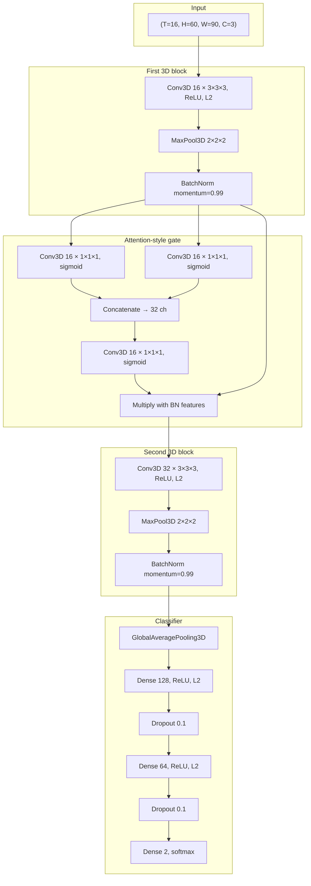

# 3D CNN with volumetric attention — `3D_CNN.ipynb`

This document describes the **spatiotemporal 3D convolutional network** defined in `3D_CNN.ipynb`, its **design intent**, and **how to run** the notebook (Google Colab or a local environment).

---

## Overview

The notebook trains a **binary classifier** on **short video clips** represented as fixed-length frame sequences. The intended use case in the notebook is **violent vs non-violent** scene classification: frames are loaded from two directory trees, resized, grouped into **16-frame** clips, and labeled from the **last frame’s** class in each clip.

| Aspect | Value |
|--------|--------|
| Framework | TensorFlow / Keras (`Model` functional API) |
| Input tensor shape | `(batch, 16, 60, 90, 3)` — **time × height × width × RGB** |
| Output | 2-class **softmax** (one-hot labels, `categorical_crossentropy`) |
| Clip length | 16 frames |
| Spatial size | 60 × 90 pixels |

---

## Architecture (detailed)

The model is implemented as `create_custom_3d_cnn_with_attention(input_shape)`. The graph is a **compact 3D CNN** with an **attention-style gating block** after the first convolutional stack, then a second 3D stack, **global average pooling** over space and time, and a small **fully connected** head.

### Data flow



### Layer-by-layer semantics

1. **First `Conv3D` (16 filters, 3×3×3, valid padding)**  
   Learns **local spatiotemporal** filters (short motion and appearance patterns). With default Keras valid convolution, **depth, height, and width** each shrink by 2 compared to the input (see `model.summary()` in the notebook for exact feature map sizes).

2. **`MaxPooling3D(2,2,2)`**  
   Downsamples **time and space**, reducing compute and increasing receptive field.

3. **`BatchNormalization(momentum=0.99)`**  
   Stabilizes activations; high momentum keeps moving statistics smooth across batches.

4. **Attention-style module (commented as “Spatial Attention”)**  
   - Two **parallel** `Conv3D(16, kernel (1,1,1), sigmoid)` branches read the **same** feature map (variable names `spatial_attention_avg` and `spatial_attention_max` suggest inspiration from **CBAM**-style attention, but **both branches are learned 1×1×1 convolutions**, not explicit global average-pooling vs max-pooling over channels).  
   - Outputs are **concatenated** along the channel axis (32 channels), then fused with another **1×1×1** sigmoid convolution back to **16** channels.  
   - The result is **multiplied element-wise** with the batch-normalized tensor from step 3. This is a **volumetric gate**: the network learns **where** (in depth, height, width) to emphasize features before deeper layers.

5. **Second `Conv3D` (32 filters, 3×3×3)**  
   Higher capacity; captures richer patterns on the gated features.

6. **Second `MaxPooling3D` + `BatchNormalization`**  
   Further subsampling and normalization.

7. **`GlobalAveragePooling3D`**  
   Averages over **all remaining time and spatial dimensions**, producing a **fixed-length vector** of size **32** (the number of filters in the last conv block). This avoids a huge flattened layer and reduces overfitting versus a large `Flatten`.

8. **Dense head**  
   `128 → Dropout(0.1) → 64 → Dropout(0.1) → 2` with **ReLU** and **L2 regularization** on dense layers.

### Training objective and optimizer

- **Loss:** `categorical_crossentropy` (one-hot targets).  
- **Optimizer:** `Adam(learning_rate=1e-4, clipvalue=1.0)` — **gradient clipping** limits step size for stability.  
- **Regularization:** `l2(0.001)` on convolutional and dense kernels; dropout **0.1** on the FC path.

---

## Novelty and positioning

This notebook is best understood as a **practical research/engineering recipe**, not a claim of new state-of-the-art theory.

**What is distinctive in this stack**

- **3D convolutions** end-to-end on clip tensors, so **motion and appearance** are modeled jointly in one network (as opposed to 2D CNN per frame + late fusion only).  
- A **lightweight attention gate** (two parallel 1×1×1 sigmoid branches → concat → 1×1×1 → **element-wise multiply**) adds **adaptive emphasis** over the 4D feature map **(D, H, W, C)** before the second conv block. This is in the family of **attention / recalibration** ideas used in vision (similar in spirit to channel/spatial attention blocks, though the exact formulation here is simplified).  
- **Global average pooling** over space-time keeps the **parameter count** of the classifier modest.

**What it is not**

- It is **not** a full **CBAM** or **non-local** block: the “avg/max” naming does not implement classical average- vs max-pooled channel descriptors.  
- It is **not** guaranteed to generalize beyond the dataset and preprocessing used in the notebook; violence detection in the wild typically needs careful ethics review, dataset balance, and evaluation protocols.

For papers and baselines in video understanding and attention, see the broader literature on **3D CNNs** (e.g. C3D, I3D) and **attention mechanisms** in video (CBAM, non-local networks, transformers). This notebook is a **small custom** variant aimed at fast experimentation on Colab.

---

## How to use this notebook

### 1. Environment

**Google Colab (as written)**  
- The first cells use `google.colab.drive` to mount Drive.  
- Ensure **TensorFlow**, **OpenCV (`cv2`)**, **scikit-learn**, and **matplotlib** are available (Colab includes most of these; install OpenCV if needed).

**Local machine**  
- Install Python 3.x, then for example:  
  `pip install tensorflow opencv-python scikit-learn matplotlib numpy`  
- Remove or skip the **Drive mount** cell and point paths to your data (see below).

### 2. Expected dataset layout

The loader walks **category folders** and expects **pre-extracted frames** under each video’s `output` subdirectory:

```text
violence_root/
  video_001/
    output/
      frame_0001.jpg
      frame_0002.jpg
      ...
nonviolence_root/
  video_002/
    output/
      ...
```

In the notebook, example paths are:

- `/content/drive/MyDrive/of/violence_of`  
- `/content/drive/MyDrive/of/nonviolence_of`  

**Change these** to your own roots. The code loads images with **OpenCV**, resizes to **(60, 90)**, assigns label **1** to violence and **0** to non-violence, and caps how many frames are read per folder via `max_frames` (default **1600** in `load_images_from_folders`).

### 3. Building sequences

`create_sequences_with_labels` builds sliding (or stepped) windows of **16** consecutive frames. The **label** for a clip is taken from the **last frame** in the window (`labels[i + sequence_length - 1]`). Adjust this if your labeling strategy differs (e.g. majority vote over the window).

### 4. Train / validation split and generators

- Labels are converted with `to_categorical(..., num_classes=2)`.  
- `train_test_split(..., test_size=0.2, random_state=42)` creates train/val splits.  
- `DataGenerator` (Keras `Sequence`) yields batches of shape aligned with the model. It applies **`np.transpose(..., (0, 2, 1, 3))`** per sample so that the effective layout matches **`(time, height, width, channels)`** as required by `input_shape = (16, 60, 90, 3)`. If you change how arrays are stored in memory, **verify this transpose** against `model`’s expected input order.

Default **batch size** in the generators is **16**.

### 5. Building and compiling the model

```text
input_shape = (16, 60, 90, 3)
cnn_model_with_attention = create_custom_3d_cnn_with_attention(input_shape)
cnn_model_with_attention.compile(optimizer=..., loss='categorical_crossentropy', metrics=['accuracy'])
```

Call `cnn_model_with_attention.summary()` to inspect layer shapes and parameter counts.

### 6. Training

The notebook configures:

- **`ModelCheckpoint`** — saves weights under `/content/checkpoints/` with filenames like `model3_epoch_{epoch:02d}.weights.h5`.  
- **`CSVLogger`** — logs metrics to a CSV for plotting.

Training uses:

```text
cnn_model_with_attention.fit(
    train_generator,
    validation_data=val_generator,
    epochs=...,   # notebook shows 40 in one run and 30 in another
    callbacks=[checkpoint_callback, csv_logger],
)
```

Adjust **epochs** and **batch size** to your GPU memory and dataset size.

**Resume training:** A later cell attempts to load the latest checkpoint via `glob` on `model3_epoch_*.h5`. If your `ModelCheckpoint` uses the **`.weights.h5`** suffix, align the **glob pattern** with the actual filenames so resume works.

### 7. Evaluation plots

After training, the notebook plots **training vs validation accuracy** (and similar) with matplotlib. Accuracy values may be scaled (e.g. ×100) for percentage display—check the exact plotting cell.

---

## Hyperparameters (reference)

| Hyperparameter | Typical value in notebook |
|----------------|---------------------------|
| Sequence length | 16 |
| Frame size | 60 × 90 |
| Batch size | 16 |
| L2 coefficient | 0.001 (convs + dense) |
| Dropout | 0.1 (after dense layers) |
| Batch norm momentum | 0.99 |
| Adam learning rate | 1e-4 |
| Gradient clip | `clipvalue=1.0` |
| Train/val split | 80% / 20%, `random_state=42` |

---

## Troubleshooting

| Issue | What to check |
|-------|----------------|
| Wrong input shape error | Confirm `DataGenerator` transpose matches `(16, 60, 90, 3)` for `channels_last`. |
| Empty or tiny dataset | Ensure `output/` folders exist and contain readable images; relax `max_frames` or fix paths. |
| Checkpoint not resuming | Match `glob` pattern to saved files (`*.h5` vs `*.weights.h5`). |
| Poor generalization | Class balance, data leakage across clips from the same video, and label noise are common issues; consider video-level splits. |

---

## File relationship

| File | Role |
|------|------|
| `3D_CNN.ipynb` | Full experiment: data loading, model, training, plots |
| `README.md` (this file) | Architecture description and usage guide |

---

## Citation and ethics

If you reuse this pipeline in academic or product work, cite **TensorFlow/Keras** and any **datasets** you use. Automated **violence detection** has **privacy and misuse** implications; deploy only with appropriate **policy, consent, and human oversight**.
